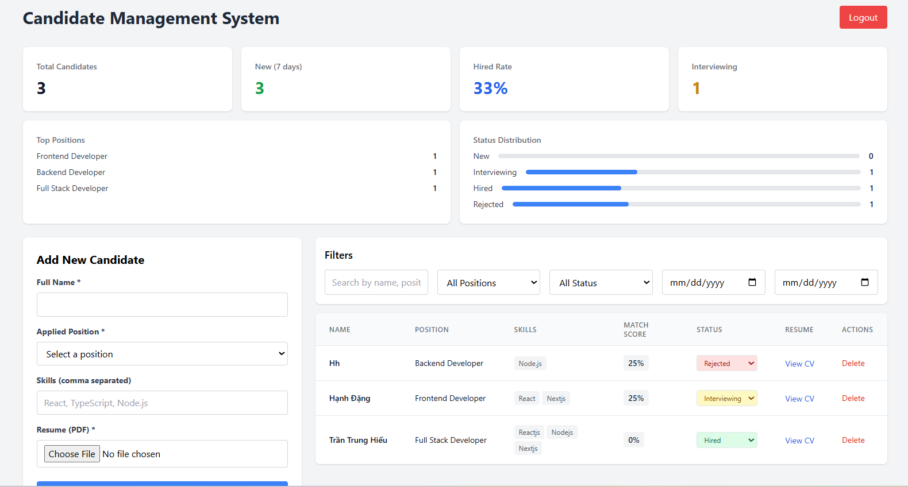
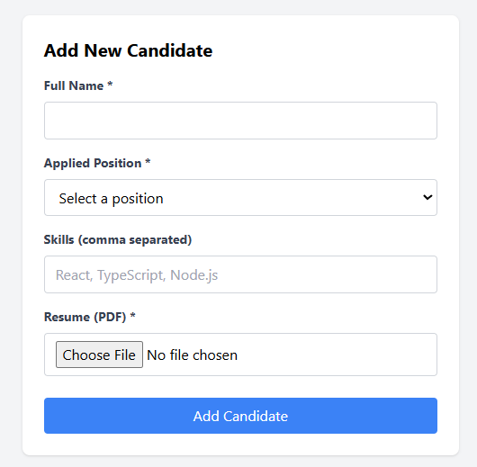

# Candidate Management System - Tài liệu dự án

##  Tổng quan

**Candidate Management System** là ứng dụng web quản lý hồ sơ ứng viên dành cho nhân viên HR, được xây dựng với React, TypeScript và Supabase. Ứng dụng cho phép quản lý hồ sơ ứng viên với các tính năng: đăng ký/đăng nhập, thêm/sửa/xóa ứng viên, upload CV, tính điểm phù hợp, thống kê và đề xuất ứng viên.

###  Tính năng chính

#### 1. Xác thực người dùng
- Đăng ký tài khoản với email
- Đăng nhập/đăng xuất
- Bảo mật với JWT token

#### 2. Quản lý ứng viên
- Thêm ứng viên với thông tin: họ tên, vị trí, kỹ năng, CV
- Upload file CV lên Supabase Storage
- Cập nhật trạng thái ứng viên (New, Interviewing, Hired, Rejected)
- Xóa ứng viên

#### 3. Tính năng nâng cao
- **Matching Score**: Tính điểm phù hợp dựa trên kỹ năng (công thức: số kỹ năng trùng / tổng số kỹ năng yêu cầu × 100)
- **Analytics Dashboard**: Thống kê tổng số, trạng thái, top vị trí, ứng viên mới trong 7 ngày
- **Recommendation Engine**: Gợi ý top 3 ứng viên phù hợp cho một vị trí
- **Real-time Updates**: Cập nhật danh sách tự động khi có thay đổi
- **Search & Filter**: Tìm kiếm full-text, lọc theo vị trí, trạng thái, ngày

#### 4. Bảo mật
- Row Level Security (RLS) đảm bảo người dùng chỉ xem được dữ liệu của mình
- Storage policies phân quyền upload/download file

---

##  Công nghệ sử dụng

| Thành phần | Công nghệ |
|------------|-----------|
| Frontend | React 18 + TypeScript + Vite |
| Styling | TailwindCSS |
| Backend | Supabase (PostgreSQL) |
| Authentication | Supabase Auth |
| Database | PostgreSQL với RLS |
| Edge Functions | Supabase Edge Functions (Deno) |
| Storage | Supabase Storage |
| Real-time | Supabase Realtime |

---


---

##  Edge Functions

### 1. `add-candidate`

**Mục đích**: Thêm ứng viên mới và tính điểm phù hợp
**Process**:
- Lấy user từ token
- Lấy required_skills từ bảng job_requirements
- Tính matching_score = (số kỹ năng trùng / tổng số kỹ năng yêu cầu) × 100
- Insert vào bảng candidates

### 2. `analytics`

**Mục đích**: Cung cấp thống kê cho dashboard

### 3. `recommend`

**Mục đích**: Gợi ý top 3 ứng viên phù hợp cho một vị trí
**Process**:
- Lấy required_skills cho vị trí
- Tính matching_score cho từng ứng viên
- Sắp xếp giảm dần và lấy top 3

##  Hướng dẫn cài đặt

### Yêu cầu hệ thống

| Thành phần | Phiên bản |
|------------|-----------|
| Node.js | 18.x trở lên |
| npm | 9.x trở lên |
| Git | Bất kỳ |
| Tài khoản | Supabase (miễn phí) |

---

```bash
### Bước 1: Clone dự án
# Clone repository
git clone https://github.com/yourusername/candidate-management.git
# Di chuyển vào thư mục dự án
cd candidate-management
```
### Bước 2: Cài đặt dependencies
```bash
# Cài đặt các package cần thiết
npm install
# Hoặc nếu dùng yarn
yarn install
```
### Bước 3: Tạo project Supabase
- Truy cập supabase.com → New project

- Điền thông tin và tạo project

- Vào Settings → API, copy: Project URL và anon public key

4. Tạo database & storage
Chạy SQL trong SQL Editor:
```bash
-- Tạo bảng candidates
CREATE TABLE candidates (
    id UUID DEFAULT gen_random_uuid() PRIMARY KEY,
    user_id UUID REFERENCES auth.users(id) ON DELETE CASCADE,
    full_name TEXT NOT NULL,
    applied_position TEXT NOT NULL,
    status TEXT DEFAULT 'New' CHECK (status IN ('New', 'Interviewing', 'Hired', 'Rejected')),
    resume_url TEXT,
    skills JSONB DEFAULT '[]',
    matching_score INTEGER DEFAULT 0,
    created_at TIMESTAMP WITH TIME ZONE DEFAULT NOW(),
    updated_at TIMESTAMP WITH TIME ZONE DEFAULT NOW()
);

-- Tạo bảng job_requirements
CREATE TABLE job_requirements (
    id UUID DEFAULT gen_random_uuid() PRIMARY KEY,
    position TEXT UNIQUE NOT NULL,
    required_skills JSONB NOT NULL,
    created_at TIMESTAMP WITH TIME ZONE DEFAULT NOW()
);

-- Thêm dữ liệu mẫu
INSERT INTO job_requirements (position, required_skills) VALUES
('Frontend Developer', '["React", "TypeScript", "HTML/CSS", "JavaScript"]'),
('Backend Developer', '["Node.js", "Python", "PostgreSQL", "REST API"]'),
('Full Stack Developer', '["React", "Node.js", "TypeScript", "PostgreSQL"]');

-- RLS Policies
ALTER TABLE candidates ENABLE ROW LEVEL SECURITY;

CREATE POLICY "Users can view own candidates" ON candidates
    FOR SELECT USING (auth.uid() = user_id);
    
CREATE POLICY "Users can insert own candidates" ON candidates
    FOR INSERT WITH CHECK (auth.uid() = user_id);
    
CREATE POLICY "Users can update own candidates" ON candidates
    FOR UPDATE USING (auth.uid() = user_id);
    
CREATE POLICY "Users can delete own candidates" ON candidates
    FOR DELETE USING (auth.uid() = user_id);
Tạo Storage bucket:
Vào Storage → Create bucket

Tên: resumes

Public bucket: 
```
5. Cấu hình .env
```bash
VITE_SUPABASE_URL=https://your-project.supabase.co
VITE_SUPABASE_ANON_KEY=your-anon-key
```
6. Deploy Edge Functions
```bash
# Cài Supabase CLI
npm install -g supabase
# Đăng nhập
supabase login
# Deploy functions
supabase functions deploy add-candidate --no-verify-jwt
supabase functions deploy analytics --no-verify-jwt
supabase functions deploy recommend --no-verify-jwt
```
7. Chạy ứng dụng
```bash
npm run dev
```
### Sau khi cài đặt
- Đăng ký tài khoản mới

- Đăng nhập

- Thêm ứng viên

- Upload CV

- Xem Analytics và danh sách ứng viên

### Giao diện

###  Trang đăng nhập

*Đăng nhập vào hệ thống với email và mật khẩu*


###  Trang đăng ký

*Tạo tài khoản mới để bắt đầu quản lý ứng viên*

### Dashboard

*Dashboard chính hiển thị danh sách ứng viên và thống kê chi tiết*

###  Thêm ứng viên

*Form thêm ứng viên mới với thông tin và CV*